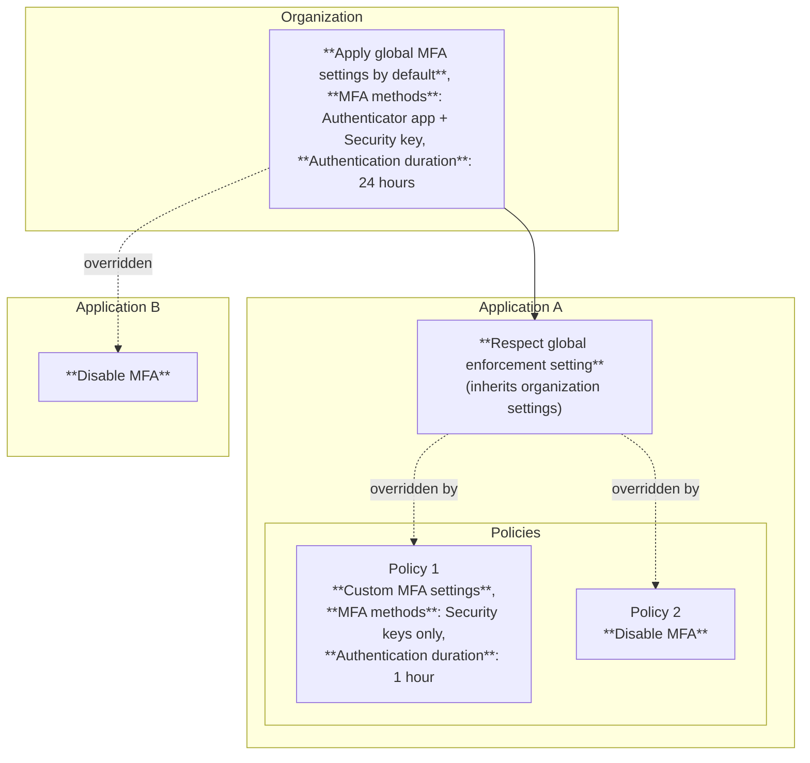

import { GlossaryTooltip, Details, Render } from "~/components";

Cloudflare Access supports two methods of enforcing multi-factor authentication (MFA):

- **[Identity provider-based MFA](#identity-provider-based-mfa)** — Require specific MFA methods reported by your identity provider (IdP).
- **[Independent MFA](#independent-mfa)** — Prompt users for a second factor directly in Access, without relying on a third-party identity provider.

For SSH connections to [infrastructure applications](/cloudflare-one/access-controls/applications/non-http/infrastructure-apps/), Access also supports [independent MFA with PIV keys](#infrastructure-applications).

## Identity provider-based MFA

You can require that users log in with specific MFA methods provided by their identity provider. For example, you can create rules that only allow users to reach a given application if they authenticate with a security key through their IdP.

IdP-based MFA enforcement is only available with the following identity providers:

- [Okta](/cloudflare-one/integrations/identity-providers/okta/)
- [Microsoft Entra ID (formerly Azure AD)](/cloudflare-one/integrations/identity-providers/entra-id/)
- [Generic OIDC](/cloudflare-one/integrations/identity-providers/generic-oidc/)
- [Generic SAML 2.0](/cloudflare-one/integrations/identity-providers/generic-saml/)

To enforce an IdP MFA requirement on an application:

1.  In the [Cloudflare dashboard](https://dash.cloudflare.com/), go to **Zero Trust** > **Access controls** > **Applications**.

2.  Find the application for which you want to enforce MFA and select **Configure**. Alternatively, [create a new application](/cloudflare-one/access-controls/applications/http-apps/).

3.  Go to **Policies**.

4.  If your application already has a policy containing an identity requirement, find it and select **Configure**.

    :::note
    The policy should contain an Include rule that uses identity-based selectors. For example, the Include rule could allow users who are part of a [rule group](/cloudflare-one/access-controls/policies/groups/), email domain, or identity provider group.
    :::

5.  Add the following rule to the policy:

        | Rule type | Selector | Value |
        | ---------- | -------- | ------ |
        | Require    | Authentication method |  `mfa - multiple-factor authentication` |

6.  Save the policy.

:::caution[Important]
If the user fails to present the required MFA method, Cloudflare Access rejects the user, even if they successfully log in to the identity provider with an alternative method.
:::

### Authentication methods in the JWT

When users authenticate with their identity provider, the IdP shares their username with Cloudflare Access. Access writes that value into the <GlossaryTooltip term="JSON web token">JSON Web Token (JWT)</GlossaryTooltip> generated for the user.

Certain identity providers also share the MFA method presented by the user. Access can add these values into the JWT. For example, if the user authenticated with their password and a security key, the IdP can send a confirmation to Cloudflare Access. Access then stores that method in the JWT issued to the user.

Cloudflare Access follows [RFC 8176](https://tools.ietf.org/html/rfc8176), Authentication Method Reference Values, to define authentication methods.

## Independent MFA

Independent MFA prompts users for a second factor directly in Access. This allows you to enforce MFA requirements without relying on your IdP's MFA configuration.

You can configure MFA requirements at three levels:

| Level                                                                            | Description                                                    |
| -------------------------------------------------------------------------------- | -------------------------------------------------------------- |
| [Organization](/cloudflare-one/access-controls/access-settings/independent-mfa/) | Enforce MFA by default for all applications in your account.   |
| [Application](#configure-independent-mfa-for-an-application)                     | Require or turn off MFA for a specific application.            |
| [Policy](#configure-independent-mfa-for-a-policy)                                | Require or turn off MFA for users who match a specific policy. |

Settings at lower levels (policy) override settings at higher levels (organization), giving you granular control over MFA enforcement.

### Prerequisites

Before you configure independent MFA on applications or policies, you must [turn on independent MFA](/cloudflare-one/access-controls/access-settings/independent-mfa/) at the organization level.

:::tip
At the organization level, you can also [restrict which authenticators can be enrolled using AAGUIDs](/cloudflare-one/access-controls/access-settings/independent-mfa/#restrict-authenticators-by-aaguid) and [skip independent MFA when the identity provider already performed MFA](/cloudflare-one/access-controls/access-settings/independent-mfa/#use-identity-provider-mfa.
:::

### Configure independent MFA for an application

Each application has three MFA options:

| Option                                 | Behavior                                                                                                                                                                                                                                               |
| -------------------------------------- | ------------------------------------------------------------------------------------------------------------------------------------------------------------------------------------------------------------------------------------------------------ |
| **Respect global enforcement setting** | Uses the [organization-level](/cloudflare-one/access-controls/access-settings/independent-mfa/) MFA configuration. If MFA is required globally, users must complete MFA. If MFA is not required globally, users are not prompted. This is the default. |
| **Custom MFA settings**                | Overrides the organization setting with application-specific allowed authenticators and session duration.                                                                                                                                              |
| **Disable MFA**                        | Users are not prompted for independent MFA when accessing this application, even if MFA is required globally.                                                                                                                                          |

To configure MFA for an application:

1. In the [Cloudflare dashboard](https://dash.cloudflare.com/), go to **Zero Trust** > **Access controls** > **Applications**.
2. Find the application you want to configure and select **Configure**.
3. Scroll down to **Authentication** and select the **MFA**.tab.
4. Select one of the following options:
   - To inherit the organization setting, select **Respect global enforcement setting**.
   - To set custom requirements, select **Custom MFA settings**, then configure the [allowed MFA methods](/cloudflare-one/access-controls/access-settings/independent-mfa/#supported-mfa-methods) and [authentication duration](#mfa-session-duration).
   - To exempt the application from MFA, select **Disable MFA**.
5. Select **Save**.

To configure MFA for an infrastructure application, refer to [Infrastructure applications](#infrastructure-applications).

### Configure independent MFA for a policy

Each policy has the same three MFA options described in [Configure independent MFA for an application](#configure-independent-mfa-for-an-application). Policy-level settings override application-level settings.

1. In the [Cloudflare dashboard](https://dash.cloudflare.com/), go to **Zero Trust** > **Access controls** > **Policies**.
2. Choose an **Allow** policy and select **Configure**.
3. Under **Multi-factor authentication (MFA)**, select an option:
   - To inherit the application or organization setting, select **Respect global enforcement setting**.
   - To set custom requirements for users who match this policy, select **Custom MFA settings**, then configure the [allowed MFA methods](/cloudflare-one/access-controls/access-settings/independent-mfa/#supported-mfa-methods) and [authentication duration](#mfa-session-duration).
   - To exempt users who match this policy from MFA, select **Disable MFA**.
4. Select **Save**.

To configure MFA for an infrastructure application policy, refer to [Infrastructure applications](#infrastructure-applications).

### MFA session duration

The MFA session duration determines how long a successful MFA authentication remains valid. After the MFA session expires, the user must complete MFA again on their next Cloudflare Access login in addition to completing IdP authentication. You can require users to complete MFA on each Access login or set a custom duration. MFA session durations are only checked during the login flow and do not affect a user's existing session.

Access checks MFA sessions from most specific to least specific:

1. **Policy MFA session duration** — If set, applies to users who match the policy.
2. **Application MFA session duration** — If set, applies to all users accessing the application.
3. **Global MFA session duration** — The default for all applications that do not specify their own duration.

### Precedence example

Consider the following configuration:



In this example:

- Users who access Application A and match Policy 1 must use a security key and re-authenticate every hour.
- Users who access Application A and match Policy 2 are not prompted for MFA.
- Users who access Application A and match neither policy must use an authenticator application or a security key, with a 24-hour session.
- Users who access Application B are not prompted for MFA.

## Infrastructure applications

Infrastructure applications that use SSH support independent MFA with [YubiKey PIV keys](/cloudflare-one/access-controls/access-settings/independent-mfa/#enroll-a-piv-key-for-infrastructure-apps). When MFA is required, users must complete public key authentication with their enrolled PIV key before the connection is established. Users must [enroll their PIV key](/cloudflare-one/access-controls/access-settings/independent-mfa/#enroll-a-piv-key-for-infrastructure-apps) through the App Launcher before they can connect.

You can configure MFA for infrastructure apps at the application level or at the policy level.

### Configure MFA for an infrastructure application

Infrastructure applications use a PIV key authenticator (`piv_key`) that is specific to SSH connections. This authenticator type is not available for other Access application types.

:::note
<Render file="access/piv-key-global-settings-warning" product="cloudflare-one" />
:::

<Details header="Dashboard">

1. In the [Cloudflare dashboard](https://dash.cloudflare.com/), go to **Zero Trust** > **Access controls** > **Applications**.
2. Find your infrastructure application and select **Configure**.
3. Go to the **Authentication** tab and select **MFA**.
4. Select one of the following options:
   - **Respect global enforcement setting** — Uses the [organization-level](/cloudflare-one/access-controls/access-settings/independent-mfa/) MFA configuration. This is the default.
   - **Custom MFA settings** — Override the global setting with a custom MFA session duration for this application.
   - **Disable MFA** — Users are not prompted for MFA when accessing this application.
5. Select **Save**.

</Details>

<Details header="API">

To update MFA settings for an infrastructure application, first send a `GET` request to retrieve the full application configuration, then send a `PUT` request with the complete application body including the `mfa_config` object. The `PUT` request must contain all fields returned by the `GET` to avoid overwriting existing settings.

```bash
curl --request PUT \
https://api.cloudflare.com/client/v4/accounts/{account_id}/access/apps/{app_id} \
--header "Authorization: Bearer <API_TOKEN>" \
--header "Content-Type: application/json" \
--data '{
  "mfa_config": {
    "mfa_disabled": false,
    "session_duration": "12h",
    "allowed_authenticators": ["piv_key"]
  }
}'
```

| Field                        | Type    | Description                                                                                                           |
| ---------------------------- | ------- | --------------------------------------------------------------------------------------------------------------------- |
| `mfa_use_global_settings`    | Boolean | If `true`, uses the organization-level MFA settings. Other fields are ignored.                                        |
| `mfa_disabled`               | Boolean | If `true`, MFA is not required for this application, even if global settings enforce MFA.                             |
| `mfa_session_duration`       | Integer | Duration in minutes before the user must re-authenticate with MFA. Set to `0` to require MFA on every SSH connection. |
| `mfa_allowed_authenticators` | Array   | List of allowed authenticator types. Use `infrastructure_ssh` for PIV keys.                                           |

</Details>

### Configure MFA for an infrastructure policy

You can set different MFA requirements for different SSH usernames by configuring MFA at the policy level. Policy-level MFA settings override application-level settings.

<Details header="Dashboard">

1. In the [Cloudflare dashboard](https://dash.cloudflare.com/), go to **Zero Trust** > **Access controls** > **Applications**.
2. Find your infrastructure application and select **Configure**.
3. Go to **Policies** and select the policy you want to configure.
4. Under **Multi-factor authentication (MFA)**, select an option:
   - **Respect global enforcement setting** — Inherits the application or organization setting.
   - **Custom MFA settings** — Set a custom MFA session duration for users who match this policy.
   - **Disable MFA** — Users who match this policy are not prompted for MFA.
5. Select **Save**.

</Details>

<Details header="API">

To update MFA settings for a policy, first send a `GET` request to retrieve the full policy configuration, then send a `PUT` request with the complete policy body including the `mfa_config` object. The `mfa_config` object uses the same fields as the [application-level configuration](#configure-mfa-for-an-infrastructure-application).

```bash
curl --request PUT \
https://api.cloudflare.com/client/v4/accounts/{account_id}/access/policies/{policy_id} \
--header "Authorization: Bearer <API_TOKEN>" \
--header "Content-Type: application/json" \
--data '{
  "name": "Require MFA for root",
  "decision": "allow",
  "include": [
    {
      "email": {
        "email": "jdoe@company.com"
      }
    }
  ],
  "mfa_config": {
    "mfa_disabled": false,
    "session_duration": "1h",
    "allowed_authenticators": ["piv_key"]
  },
  "connection_rules": {
    "ssh": {
      "usernames": ["root"],
      "allow_email_alias": false
    }
  }
}'
```

</Details>

### MFA session duration for SSH

The MFA session duration determines how long after performing MFA a user can open new SSH connections without being prompted again. After the session expires, the user must re-authenticate with their PIV key on their next SSH connection. Existing SSH sessions are not affected by session expiration. Set the session duration to `0` to require MFA on every SSH connection.

MFA sessions are bound to the user's device. If a user switches to a different device, they must re-authenticate regardless of the remaining session duration.

Session duration is evaluated in the following order:

1. **Policy-level duration** — If set, applies to users who match the policy.
2. **Application-level duration** — If no policy-level duration is set, uses the application setting.
3. **Organization-level duration** — If neither policy nor application defines a duration, uses the global setting.

When a user matches multiple policies that each define a session duration, Access uses the **shortest** duration across all matching policies.

### Precedence and conflict resolution

MFA configuration is evaluated from most specific to least specific: **policy** > **application** > **organization**.

| Organization MFA | Application MFA | Policy MFA | Result                                      |
| ---------------- | --------------- | ---------- | ------------------------------------------- |
| Required         | Required        | Required   | MFA required                                |
| Required         | Required        | Disabled   | MFA not required (policy wins)              |
| Required         | Disabled        | (not set)  | MFA not required (application wins)         |
| Required         | (not set)       | (not set)  | MFA required (organization setting applies) |

Organization-level MFA must be enabled for users to enroll PIV keys. Explicit settings at a lower level (policy or application) override higher levels. If no explicit setting exists at a level, the next higher level applies.
